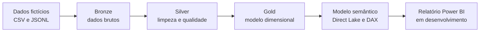

# Microsoft Fabric DP-700 — POC Energia

Prova de conceito de engenharia e análise de dados desenvolvida no **Microsoft Fabric**, no âmbito da preparação para a certificação **Microsoft Certified: Fabric Data Engineer Associate (DP-700)**.

O projeto simula uma solução de dados para o setor da energia, utilizando dados inteiramente fictícios sobre clientes, unidades de consumo, consumos, faturação e pedidos de serviço.

> **Estado do projeto:** engenharia de dados e modelo semântico concluídos. O relatório analítico em Power BI foi concluído e validado. A solução apresenta uma visão geral dos principais indicadores e uma página de análise operacional com filtros interativos por ano, concelho e segmento.

## Objetivos

- Aplicar a arquitetura Medallion no Microsoft Fabric.
- Ingerir dados CSV e JSON Lines numa Lakehouse.
- Integrar cargas iniciais e incrementais.
- Limpar, normalizar e deduplicar dados com PySpark.
- Implementar controlos de qualidade e tratamento de rejeitados.
- Construir um modelo dimensional em estrela.
- Criar um modelo semântico em modo Direct Lake.
- Definir medidas DAX para análise de negócio.
- Documentar decisões, erros encontrados e respetivas correções.

## Arquitetura da solução

## Tecnologias utilizadas

- Microsoft Fabric
- OneLake e Lakehouse
- Apache Spark e PySpark
- Delta Lake
- Notebooks Fabric
- Modelação dimensional
- Direct Lake
- DAX
- Power BI
- GitHub

## Dados disponibilizados

O pacote contém:

- clientes;
- unidades de consumo;
- consumos;
- faturas;
- pedidos de serviço;
- cargas incrementais;
- eventos de consumo em tempo real;
- base de dados relacional SQLite;
- dicionário de dados;
- scripts SQL de criação e validação.

Todos os dados são **fictícios** e foram preparados exclusivamente para aprendizagem e demonstração técnica.

## Resultados da camada Gold

| Tabela | Registos |
|---|---:|
| `gold_dim_cliente` | 510 |
| `gold_dim_unidade` | 800 |
| `gold_dim_data` | 727 |
| `gold_fact_consumo` | 19 998 |
| `gold_fact_consumo_rejeitados` | 2 |
| `gold_fact_faturacao` | 9 999 |
| `gold_fact_pedido` | 10 199 |
| `gold_fact_pedido_rejeitados` | 1 |

## Modelo semântico

O modelo semântico `POC_Energia_Modelo_Semantico` foi criado em modo **Direct Lake** e contém:

- 3 dimensões;
- 3 tabelas de factos;
- 8 relações ativas;
- 12 medidas DAX;
- indicadores de consumo, faturação, pedidos, clientes e unidades.

## Conteúdo do repositório

### Notebooks

- [`NB_Transformacao_Bronze_Silver.ipynb`](NB_Transformacao_Bronze_Silver.ipynb) — integração, limpeza, conversão de tipos, deduplicação e validação da camada Silver.
- [`NB_Modelacao_Silver_Gold.ipynb`](NB_Modelacao_Silver_Gold.ipynb) — dimensões, factos, chaves substitutas, registos rejeitados e validação da camada Gold.

### Dados

- [`Pacote_Dados_Ficticios_Microsoft_Fabric_DP700.zip`](Pacote_Dados_Ficticios_Microsoft_Fabric_DP700.zip) — dados, dicionário, scripts SQL e documentação do conjunto de dados.

### Guias

- [`Guia_Pratica_Microsoft_Fabric_Bronze_Silver_Gold.pdf`](Guia_Pratica_Microsoft_Fabric_Bronze_Silver_Gold.pdf) — implementação das três camadas, scripts, validações, erros e correções.
- [`Guia_Modelo_Semantico_Microsoft_Fabric.pdf`](Guia_Modelo_Semantico_Microsoft_Fabric.pdf) — criação das relações, medidas DAX, formatação e validação do modelo semântico.

## Como reproduzir a POC

1. Criar uma área de trabalho com capacidade Microsoft Fabric.
2. Criar uma Lakehouse.
3. Descarregar e extrair o pacote de dados fictícios.
4. Carregar os ficheiros nas pastas correspondentes da área `Files/Bronze`.
5. Importar e executar o notebook `NB_Transformacao_Bronze_Silver.ipynb`.
6. Confirmar as tabelas e os controlos de qualidade da camada Silver.
7. Importar e executar o notebook `NB_Modelacao_Silver_Gold.ipynb`.
8. Validar as dimensões, os factos e os registos rejeitados.
9. Criar o modelo semântico Direct Lake sobre as tabelas Gold.
10. Configurar as relações e medidas DAX descritas no guia do modelo semântico.

## Principais aprendizagens

- Separação entre dados brutos, dados tratados e estruturas analíticas.
- Integração segura de cargas incrementais com deduplicação pelo registo mais recente.
- Utilização de chaves substitutas num modelo dimensional.
- Preservação de registos rejeitados para auditoria e melhoria da qualidade.
- Construção de dimensões partilhadas para clientes, unidades e datas.
- Preparação de um modelo semântico otimizado para exploração em Power BI.

## Próximos passos

- Desenvolver o relatório analítico em Power BI.
- Adicionar indicadores e visualizações de consumo, faturação e pedidos.
- Implementar atualização e orquestração através de pipelines.
- Explorar ingestão e análise de eventos em tempo real.

## Autoria

**Flórida Araújo**  
Mestre em Informação e Sistemas Empresariais  
Projeto desenvolvido no âmbito da preparação para a certificação DP-700.

## Nota

Este repositório tem finalidade exclusivamente educativa e de demonstração. Não contém dados de clientes, sistemas ou organizações reais.
